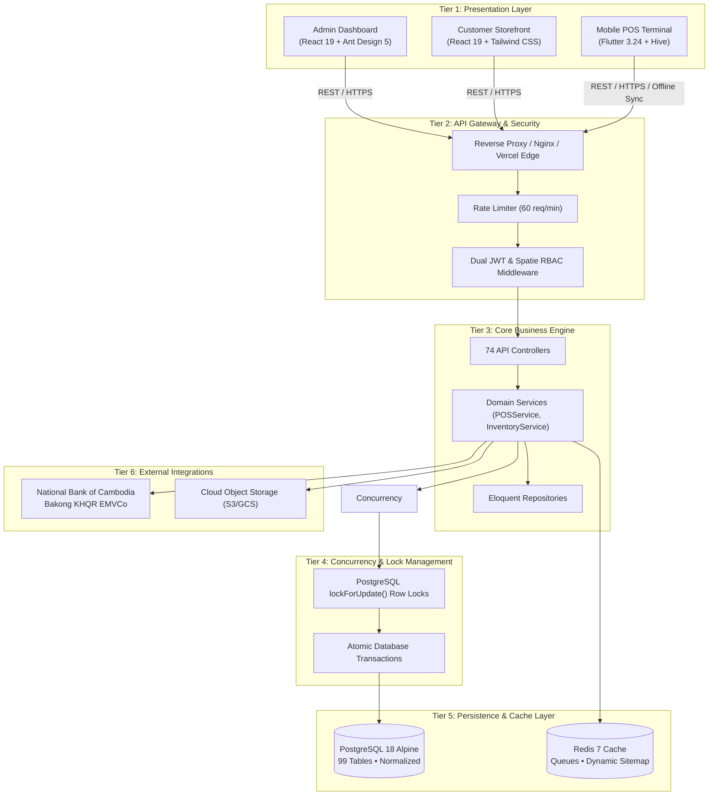

# 01. High-Level 6-Tier Architecture Blueprint

## 1. Overview
OptaPOS is engineered as a decoupled, multi-tier distributed architecture ensuring strict separation of concerns, high throughput, zero race conditions, and complete data integrity.

---

## 2. Tier Breakdown

### Tier 1: Presentation Layer (Clients)
- **Admin Dashboard**: SPA delivering 258 pages for operations, analytics, and permissions.
- **Customer Storefront**: SEO-optimized customer portal for online shopping and KHQR checkout.
- **Mobile POS**: Touch terminal for cashiers supporting offline transaction queuing.

### Tier 2: API Gateway & Authentication
- Handles CORS, SSL termination, request throttling, Dual JWT validation (`tymon/jwt-auth`), and Spatie role checking across 169 permission nodes.

### Tier 3: Core Business Engine (Laravel 12)
- Implements the **Service-Repository Pattern**:
  - `POSService`: Shift management, cart validation, tax calculation, split payments.
  - `InventoryService`: Warehouse stock adjustments, transfers, FIFO cost computation.
  - `AttendanceService`: Dynamic anti-fraud QR code signing and geolocation validation.
  - `PayrollService`: Cambodian progressive tax withholding, NSSF, and seniority pay calculations.

### Tier 4: Concurrency & Lock Management
- Eliminates race conditions by wrapping inventory updates inside `DB::transaction()` and acquiring `SELECT ... FOR UPDATE` locks on product variant stock rows.

### Tier 5: Persistence Layer (PostgreSQL 18 & Redis 7)
- **PostgreSQL 18 Alpine**: Primary relational database with 99 tables, foreign keys with strict cascade constraints, and B-Tree indexes.
- **Redis 7**: In-memory caching for session states, active token blacklists, and asynchronous job queues.

---
*Related Docs:*
- [04-Backend Architecture](file:///Users/macbook/Workspace/projects/showcase/Project-Enterprise-E-Commerce-POS-System/docs/architecture/04-backend-architecture.md)
- [06-Database Architecture](file:///Users/macbook/Workspace/projects/showcase/Project-Enterprise-E-Commerce-POS-System/docs/architecture/06-database-architecture.md)
