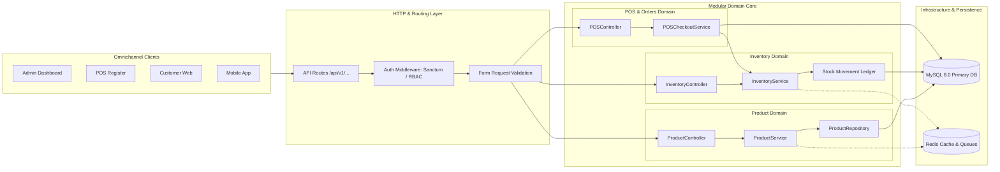

# ⚙️ Backend Architecture (Laravel REST API)

## 1. Architectural Philosophy

The backend application is built on **Laravel 11** using a **Modular Domain-Driven Monolith** architecture. This pattern offers the simplicity and rapid development of a single codebase while maintaining clear domain boundaries, modularity, and easy extraction into microservices if needed.



---

## 2. Directory Structure (`backend/`)

```text
backend/
├── app/
│   ├── Http/
│   │   ├── Controllers/
│   │   │   ├── Api/V1/          # RESTful API Controllers
│   │   │   │   ├── AuthController.php
│   │   │   │   ├── ProductController.php
│   │   │   │   ├── CategoryController.php
│   │   │   │   ├── BrandController.php
│   │   │   │   ├── InventoryController.php
│   │   │   │   ├── POSController.php
│   │   │   │   ├── OrderController.php
│   │   │   │   ├── CustomerController.php
│   │   │   │   ├── SupplierController.php
│   │   │   │   ├── EmployeeController.php
│   │   │   │   └── ReportController.php
│   │   ├── Middleware/          # Auth, CORS, Permissions, RateLimiting
│   │   └── Requests/            # Form Request Validation Rules
│   ├── Models/                  # Eloquent Entities & Relationships
│   │   ├── User.php
│   │   ├── Product.php
│   │   ├── ProductVariant.php
│   │   ├── Category.php
│   │   ├── Brand.php
│   │   ├── Warehouse.php
│   │   ├── StockLevel.php
│   │   ├── StockMovement.php
│   │   ├── Order.php
│   │   ├── OrderItem.php
│   │   ├── PosSale.php
│   │   └── Customer.php
│   ├── Services/                # Business Logic & Transaction Handling
│   │   ├── InventoryService.php # Atomic stock increment/decrement
│   │   ├── POSService.php       # Cart checkout & tender calculations
│   │   ├── ReportService.php    # Aggregation & metric calculations
│   │   └── NotificationService.php
│   ├── Events/                  # Domain Events (e.g., StockDepletedEvent)
│   └── Jobs/                    # Asynchronous Queue Workers
├── config/                      # Application, Database, Cache, Sanctum configs
├── database/
│   ├── migrations/              # Database Schema Definitions
│   └── seeders/                 # Demo & Production Seed Data
├── routes/
│   └── api.php                  # Central API Route Declarations
└── tests/                       # Unit & Feature Test Suites
```

---

## 3. Key Design Patterns & Features

### 3.1 Strict Stock Ledger & ACID Concurrency
Stock quantity updates use database transactions and atomic decrementing with row locking to prevent overselling:

```php
DB::transaction(function () use ($warehouseId, $productId, $quantity) {
    $stock = StockLevel::where('warehouse_id', $warehouseId)
        ->where('product_id', $productId)
        ->lockForUpdate()
        ->firstOrFail();

    if ($stock->quantity < $quantity) {
        throw new InsufficientStockException("Insufficient stock for product ID: {$productId}");
    }

    $stock->decrement('quantity', $quantity);

    // Record immutable audit movement
    StockMovement::create([
        'warehouse_id' => $warehouseId,
        'product_id' => $productId,
        'type' => 'sale',
        'quantity' => -$quantity,
        'balance_after' => $stock->quantity,
        'user_id' => auth()->id(),
    ]);
});
```

### 3.2 Granular RBAC (Role-Based Access Control)
Permissions are enforced at route and controller levels:
- `products.view`, `products.create`, `products.edit`, `products.delete`
- `inventory.view`, `inventory.adjust`, `inventory.transfer`, `inventory.audit`
- `pos.access`, `pos.discount`, `pos.void_sale`
- `reports.financial`, `reports.sales`
