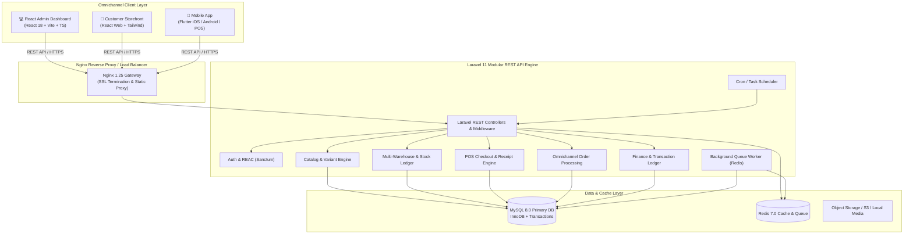

# 🏗️ System Overview & Architecture

## 1. Executive Summary

The **Enterprise E-Commerce & POS System** is a unified omnichannel commerce platform designed to handle multi-warehouse inventory, high-concurrency offline/online Point of Sale operations, e-commerce transactions, financial reporting, and comprehensive customer relationship management.



---

## 2. Monorepo Structure

```text
enterprise-ecommerce-pos/
├── admin-dashboard/        # React 18 + Vite + TypeScript (Admin & POS)
├── backend/                # Laravel 11 REST API & Business Logic
├── customer-website/       # React Web Customer Storefront
├── mobile_app/             # Flutter Multiplatform App (iOS, Android, Mobile POS)
├── docs/                   # Architecture, API & Database Documentation
│   ├── architecture/       # System & component architectures
│   ├── api/                # API guides & endpoints specification
│   └── database/           # Schema overview & data dictionary
├── .github/                # CI/CD Workflows & PR Templates
│   ├── workflows/          # GitHub Actions CI for all apps
│   ├── ISSUE_TEMPLATE/     # Bug & Feature templates
│   └── pull_request_template.md
├── docker-compose.yml      # Orchestration for PHP, Nginx, MySQL, Redis
└── README.md               # Root Project Readme
```

---

## 3. Technology Stack Breakdown

### 🖥️ Client Applications
- **Admin Dashboard & Web POS** (`admin-dashboard/`):
  - **Framework**: React 18 + Vite + TypeScript
  - **Styling**: Tailwind CSS, Lucide Icons, Framer Motion
  - **State & Queries**: TanStack Query (React Query) v5, Context API
  - **i18n Localization**: `i18next` supporting 5 languages: Khmer (`km`), English (`en`), Chinese (`zh`), Thai (`th`), Vietnamese (`vi`).
  - **Key Features**: Global Workspace Tabs (`WorkspaceTabs.tsx`), dynamic table columns (`ColumnSettingsPopover.tsx`), printable receipts, barcode scanner integration.

- **Customer Storefront** (`customer-website/`):
  - **Framework**: React 18 + Vite + Tailwind CSS
  - **Features**: Product catalog, multi-currency display, shopping cart, checkout, order tracking.

- **Mobile Application** (`mobile_app/`):
  - **Framework**: Flutter 3.x / Dart
  - **Platforms**: iOS, Android, Desktop POS
  - **Key Features**: Offline caching, camera barcode scanning, Bluetooth/Wi-Fi thermal receipt printing.

### ⚙️ Backend Services (`backend/`)
- **Framework**: Laravel 11 (PHP 8.2+)
- **Architecture**: Modular Domain-Driven Structure (Modules: Products, Inventory, Orders, POS, Customers, Finance, CMS, Notifications).
- **Authentication**: Laravel Sanctum (Bearer Token / JWT) with Granular RBAC Permissions.
- **Asynchronous Processing**: Redis Queue Workers for transactional emails, inventory audits, and report generation.
- **Database Engine**: MySQL 8.0 with InnoDB ACID transactions and row-level locking for stock management.
- **Caching**: Redis 7.0 for cache tags, session storage, and rate limiting.
