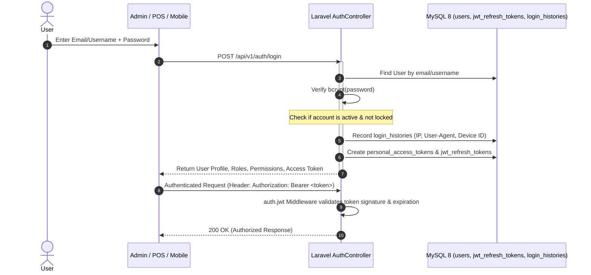

# 🔐 Authentication & Session Security Architecture

## 1. Authentication Overview

The system uses **Laravel Sanctum** with custom JWT token handling, refresh tokens, and multi-device session tracking.

---

## 2. Token Lifecycle & Expiration

- **Access Token**: Short-lived (e.g. 1 hour / 24 hours) for high API security.
- **Refresh Token**: Long-lived (e.g. 30 days) stored in `jwt_refresh_tokens`.
- **Token Refresh**: Client calls `POST /api/v1/auth/refresh` to obtain a fresh access token without requiring re-login.
- **Multi-Device Revocation**:
  - `POST /api/v1/auth/logout`: Revokes active token on current device.
  - `POST /api/v1/auth/logout-all-devices`: Revokes all tokens across all devices.
  - `POST /api/v1/devices/{id}/revoke`: Granularly disconnects a specific suspicious device.

---

## 3. Manager Security PIN Override

For sensitive operations on the POS (e.g., voiding a completed sale, offering discounts above cashier limit, opening cash drawer manually):
- The cashier triggers a Manager Override modal.
- Calls `POST /api/v1/security/verify-manager-pin`.
- Requires a manager's 4-to-6 digit hashed PIN to proceed and logs an immutable audit event.
