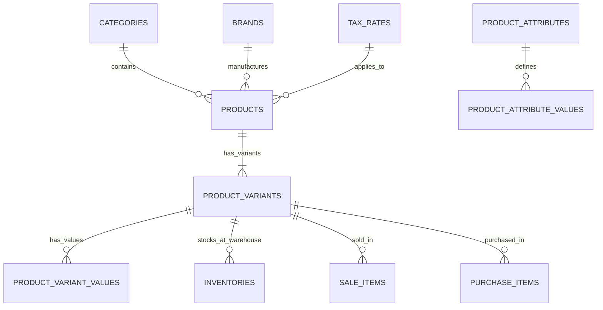

# 📦 Product Domain Manual

## 1. Overview
The **Product Domain** manages the multi-channel item catalog across simple goods, composite packages, and variable items with attribute combinations (e.g. Color, Storage, Size).

---

## 2. Domain Data Model & ER Relationships

---

## 3. Key Files in Codebase

| Layer | File Path | Purpose |
|---|---|---|
| **Backend Model** | `backend/app/Models/Product/Product.php` | Core Eloquent model, soft deletes, price casts |
| **Variant Model** | `backend/app/Models/Product/ProductVariant.php` | SKU, Barcode, Selling Price, Cost Price, Weight |
| **API Controller** | `backend/app/Http/Controllers/Api/V1/Product/ProductController.php` | CRUD, search, bulk import/export |
| **Domain Service** | `backend/app/Services/Product/ProductService.php` | Matrix generator, image processing |
| **Admin Page** | `admin-dashboard/src/pages/products/ProductListPage.tsx` | Product catalog table, bulk actions |
| **Storefront Page**| `customer-website/src/pages/ProductDetailPage.tsx` | Variant picker, stock status, reviews |
| **Mobile Screen** | `mobile_app/lib/features/product/presentation/pages/product_list_page.dart` | Mobile product lookup |

---

## 4. Business Rules & Validations

1. **SKU Uniqueness**: Every `product_variants.sku` must be globally unique across all branches and companies.
2. **Barcode Format**: Barcodes support EAN-13, UPC-A, and Code-128. If not provided, an automatic EAN-13 barcode is generated.
3. **Price Safety**: `selling_price` must never be less than 0. If `selling_price < cost_price`, a warning is logged in the audit trail.
4. **Cascade Deletion**: Products use Soft Deletes (`deleted_at`). A product with active sales cannot be hard-deleted from PostgreSQL.

---
*Related Docs:*
- [Inventory Domain Manual](file:///Users/macbook/Workspace/projects/showcase/Project-Enterprise-E-Commerce-POS-System/docs/business-domains/inventory/README.md)
- [Database Products Table](file:///Users/macbook/Workspace/projects/showcase/Project-Enterprise-E-Commerce-POS-System/docs/database/tables/products.md)
