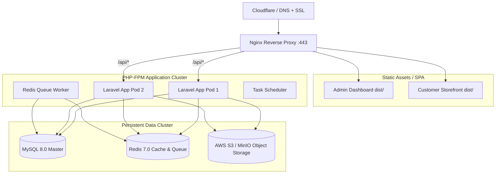

# 🚀 Production Deployment & Infrastructure Guide

## 1. Production Architecture (Docker Swarm / Kubernetes / VPS)



---

## 2. Docker Compose Deployment Commands

```bash
# 1. Pull latest code & build images
git pull origin main
docker compose build --no-cache

# 2. Start container stack in daemon mode
docker compose up -d

# 3. Execute database migrations
docker compose exec app php artisan migrate --force

# 4. Cache configurations & routes
docker compose exec app php artisan config:cache
docker compose exec app php artisan route:cache
docker compose exec app php artisan view:cache

# 5. Restart background queue worker
docker compose exec app php artisan queue:restart
```
