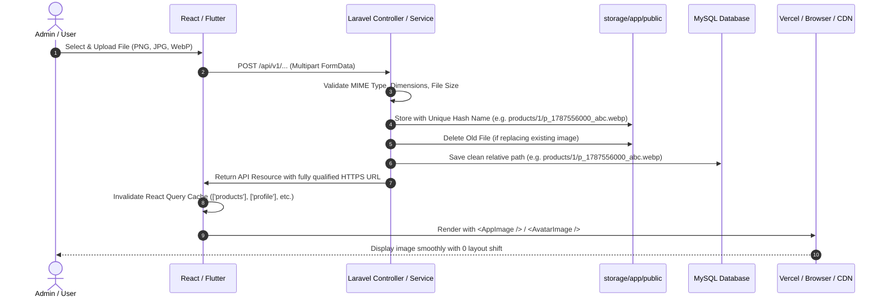

# 📁 Enterprise Media & Image Storage Architecture Guide

> **Official Standard Guide for Project-Enterprise-E-Commerce & POS System**  
> *Targeted for Laravel 11 Backend, React 19 Admin Dashboard, React 19 Customer Storefront, and Flutter Mobile App.*

---

## 🇰🇭 ១. សេចក្តីសង្ខេបស្ថាបត្យកម្មរូបភាពទូទាំងប្រព័ន្ធ (Executive Summary)

ប្រព័ន្ធគ្រប់គ្រងរូបភាព និងឯកសារ (Media & Image Storage Architecture) នៅក្នុងគម្រោង Enterprise នេះ ត្រូវបានរៀបចំឡើងតាមស្តង់ដារ **Single Source of Truth (SSOT)**៖

1. **Backend ជាអ្នកគ្រប់គ្រង និងបង្កើត Public URL**:
   * Laravel ប្រើប្រាស់ `Storage::disk('public')` រួមជាមួយ `App\Http\Resources\Traits\FormatsMediaUrl` ដើម្បីបម្លែងរាល់ Path ក្នុង Database ទៅជា Full HTTPS Production URL ស្វ័យប្រវត្តិ។
2. **Frontend មាន Universal Media Resolver តែមួយ**:
   * `resolveMediaUrl()` ក្នុង `admin-dashboard/src/utils/image.ts` និង `customer-website/src/lib/utils.ts` ធានាថារូបភាពគ្រប់ប្រភេទ (Data URI, Local Asset, Storage Path, Cloudinary/Unsplash CDN) ដំណើរការយ៉ាងរលូន។
   * Localhost/127.0.0.1 ពី Database Seeds ត្រូវបាន Rewrite ទៅកាន់ Active Backend Storage Endpoint ដោយស្វ័យប្រវត្តិ។
3. **Reusable Image Components & Fallbacks**:
   * `<AppImage />` & `<AvatarImage />` (Admin)
   * `<ImageWithFallback />` (Customer Website)
   * `AppNetworkImage` (Flutter Mobile App)
   * គ្មានប្រអប់ Broken Image Box លើ Browser ឡើយ ព្រោះមាន Shimmer Loading Skeleton និង Dynamic Fallback ស្វ័យប្រវត្តិតាម Category/Entity។

---

## 🏗️ ២. Image Flow Lifecycle



---

## 📑 ៣. Media Field Matrix Across All Modules

| Entity / Table | Field(s) | Laravel Resource | Admin Component | Customer Component | Mobile App | Fallback Strategy |
| :--- | :--- | :--- | :--- | :--- | :--- | :--- |
| **Products** | `image`, `primary_image`, `images[].image` | `ProductResource`, `ProductVariantResource` | `<ProductThumbnail />`, `<AppImage />` | `<ProductCard />`, `<ImageWithFallback />` | `AppNetworkImage` | Category-specific high-res photo or initial package badge |
| **Users / Auth** | `avatar` | `UserResource`, `ProfileResource` | `<AvatarImage />`, Header Profile | Account Dropdown | Profile Avatar | Name initials colored monogram badge |
| **Employees** | `photo` | `EmployeeResource` | `<AvatarImage />`, Employee Table | N/A | Cashier Profile | Name initials colored monogram badge |
| **Customers** | `photo`, `avatar` | `CustomerResource` | `<AvatarImage />`, Customer Table | Account Profile | Member Profile | Name initials colored monogram badge |
| **Brands** | `logo` | `BrandResource` | `<AppImage />`, Brands Grid/Table | Brand Marquee, Filter | Brand Logo Badge | Brand initial badge with gradient |
| **Categories** | `image`, `icon` | `CategoryResource` | `<AppImage />`, Category Tree | Mega Menu, Category Grid | Category Icon/Image | Category icon visual badge with themed background |
| **Banners / Hero** | `image`, `mobile_image` | `BannerResource` | `<AppImage />`, Banners Table | Hero Slider, Promo Banners | Promo Banner Carousel | Default modern retail hero graphic |
| **Blogs / CMS** | `featured_image` | `BlogResource` | `<AppImage />`, Blog Editor | Blog Cards, Blog Detail | Article Thumbnail | Default tech/ecommerce article cover |
| **Companies / Stores**| `logo`, `favicon` | `CompanyResource`, `SettingResource` | `<BrandLogo />`, Header, Favicon | Storefront Header, Favicon | Drawer Brand Logo | SVG / Monogram Fallback Logo |
| **Notifications** | `image`, `icon` | `NotificationResource` | Notification Drawer | Notification Center | Push Notification Icon | Notification category icon |

---

## ⚙️ ៤. File Validation & Upload Best Practices

### Validation Rules in Laravel Form Requests:
```php
'image' => ['nullable', 'file', 'image', 'mimes:jpeg,png,jpg,webp,svg', 'max:5120'], // Max 5MB
'logo'  => ['nullable', 'file', 'image', 'mimes:jpeg,png,jpg,webp,svg', 'max:2048'], // Max 2MB
'photo' => ['nullable', 'file', 'image', 'mimes:jpeg,png,jpg,webp', 'max:3072'],     // Max 3MB
```

### Cache Invalidation on Frontend:
When updating images via React Query mutations, always invalidate the specific query key:
```ts
// Example: Product update
queryClient.invalidateQueries({ queryKey: ['products'] })
queryClient.invalidateQueries({ queryKey: ['products', productId] })

// Example: Profile photo update
queryClient.invalidateQueries({ queryKey: ['profile'] })
queryClient.invalidateQueries({ queryKey: ['user'] })
```

---

## 🛡️ ៥. Security & Permissions

* **Public Storage (`storage/app/public`)**: Accessible for product photos, brand logos, user avatars, and banners.
* **Private Storage (`storage/app/private`)**: Strictly reserved for internal receipts, sensitive customer tax documents, payroll invoices, and export archives. Never expose private files as static URLs.
