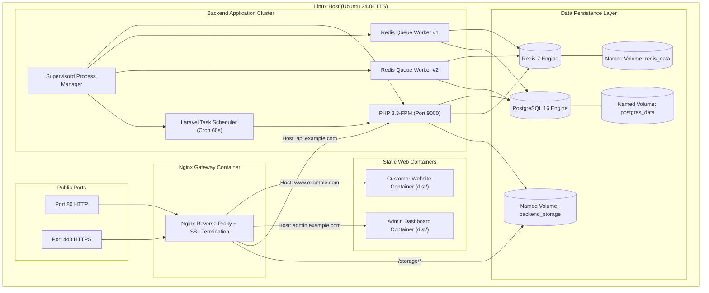

# 🏗️ ហេដ្ឋារចនាសម្ព័ន្ធ និងបណ្តាញប្រព័ន្ធ (Infrastructure & Network Topology)

ឯកសារនេះបង្ហាញអំពីរចនាសម្ព័ន្ធលម្អិតនៃ Containers, Data Storage Volumes, Process Supervision, និង Reverse Proxy Routing។

---

## 1. ដ្យាក្រាមរចនាសម្ព័ន្ធ Containers (Container Topology Diagram)

---

## 2. ការបែងចែក Persistent Volumes

ដើម្បីធានាថារូបភាពទំនិញ និងទិន្នន័យ Database មិនបាត់បង់ពេល Restart Containers:
1. `postgres_data`: រក្សាទុកទិន្នន័យ Tables, Indexes, Sequences, និង Relations ទាំងអស់របស់ PostgreSQL 16 នៅក្នុង `/var/lib/postgresql/data`។
2. `redis_data`: រក្សាទុក AOF (Append-Only File) Snapshots របស់ Redis នៅក្នុង `/data`។
3. `backend_storage`: រក្សាទុកឯកសារដែល Upload មក (Product images, Avatars, Category icons, Invoices, Exported Excel reports) នៅក្នុង `/var/www/storage`។

---

## 3. ដំណើរការ Supervisor Process Manager

នៅក្នុង `backend` container មានដំណើរការ `supervisord` ដែលគ្រប់គ្រង Background Services ស្វ័យប្រវត្ត៖
- **`php-fpm`**: ទទួលសំណើ API ពី Nginx Gateway។
- **`laravel-queue`**: ដំណើរការ 2 Workers ស្របគ្នា (`queue:work redis --sleep=3 --tries=3 --max-time=3600`) ដើម្បីផ្ញើ Email, Push Notifications, និងបង្កើតរបាយការណ៍។
- **`laravel-scheduler`**: ដំណើរការ Cron Jobs រៀងរាល់ 1 នាទីម្តង (`php artisan schedule:run`) សម្រាប់ពិនិត្យ Flash Sale, លុប Expired Carts, និង Auto-cleanup។
