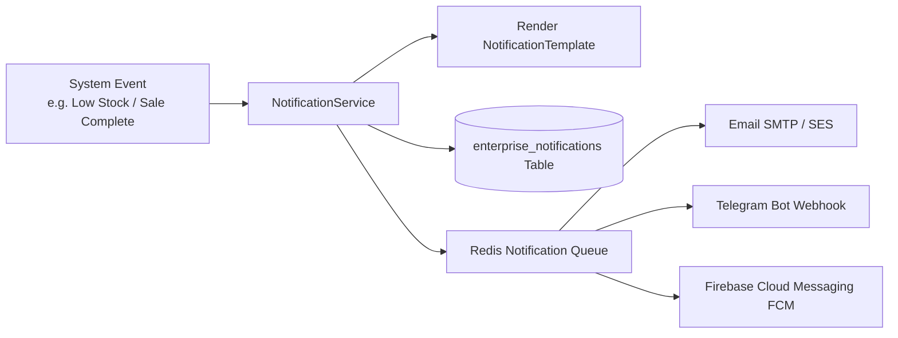

# 🔔 Enterprise Notifications Architecture

## 1. Multi-Channel Notification Pipeline

The platform supports in-app popovers, real-time alerts, email notifications, and SMS/Telegram webhook dispatches.

---

## 2. Notification Data Model

- `enterprise_notifications`: Stores individual notification instances per user (`user_id`, `type`, `title`, `message`, `data`, `read_at`).
- `notification_templates`: Configurable multilingual templates with dynamic variable placeholders (`{order_number}`, `{customer_name}`, `{stock_qty}`).
- `notification_settings`: Per-user subscription preferences (e.g., enable/disable email for low-stock alerts).
