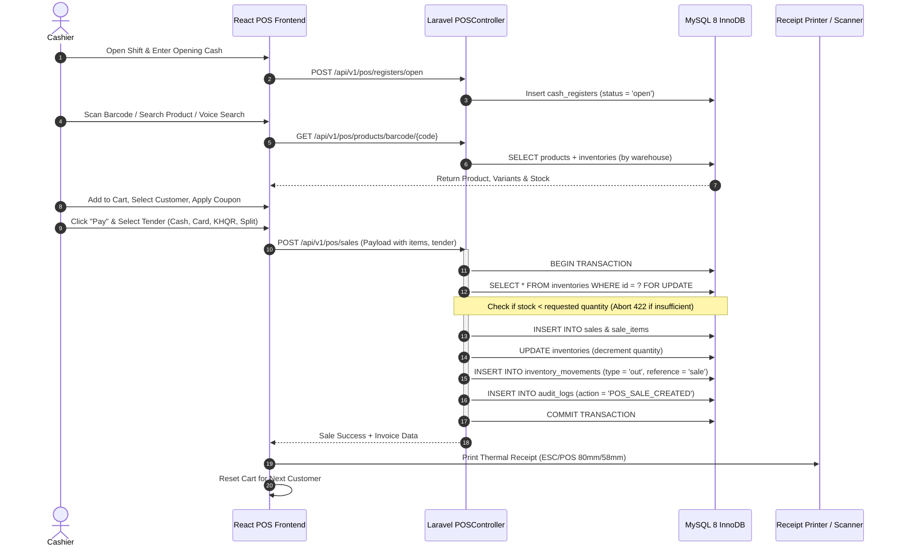

# ⚡ Point of Sale (POS) Complete Flow & Transaction Lifecycle

## 1. POS Architecture Overview

The Point of Sale (POS) module is designed for sub-second checkout speeds, offline resilience, cash drawer controls, split payments, and atomic stock deductions.

---

## 2. Step-by-Step Flow Explanation

### Step 1: Register Shift Management (`cash_registers`)
- Cashier enters their initial float cash (`opening_balance`).
- Prevents checkout if no register shift is currently open for the cashier.
- At end of shift, cashier counts cash drawer and submits `closing_balance`. System calculates overage/shortage discrepancy.

### Step 2: High-Speed Product Lookup
- **Hardware Laser Scanner / Camera**: Reads standard EAN-13, Code 128, QR codes via `GET /api/v1/pos/products/barcode/{code}`.
- **Instant Search**: Debounced indexed fulltext search via `GET /api/v1/pos/product-search`.
- **AI Voice Search & Visual Search**: `POST /api/v1/pos/voice-search` and `POST /api/v1/pos/vision-search` for hands-free lookup.

### Step 3: Cart Calculation & Tax Engine
- Multi-tier discounts: Item-level discount + Order-level coupon code.
- Automatic tax calculation: Computes VAT/Sales tax per item based on assigned tax rates (`tax_percent` & `tax_amount`).

### Step 4: Strict Stock Deduction & Concurrency Lock
- **No Negative Ghost Stock**: The backend locks rows using `SELECT ... FOR UPDATE`. If stock is lower than requested quantity, transaction aborts with HTTP `422` and returns a localized error message.
- **Audit Movement**: Every sale creates a permanent audit movement in `inventory_movements` with `quantity_before` and `quantity_after`.

### Step 5: Split Tender & Receipt Generation
- Supports multi-tender payments (e.g. $20 Cash + $35 KHQR/ABA Bank).
- Formats standard thermal receipt with Invoice #, Cashier Name, Store Address, Itemized Table, Subtotal, VAT, Total in USD & KHR (Riel), and QR Code.
