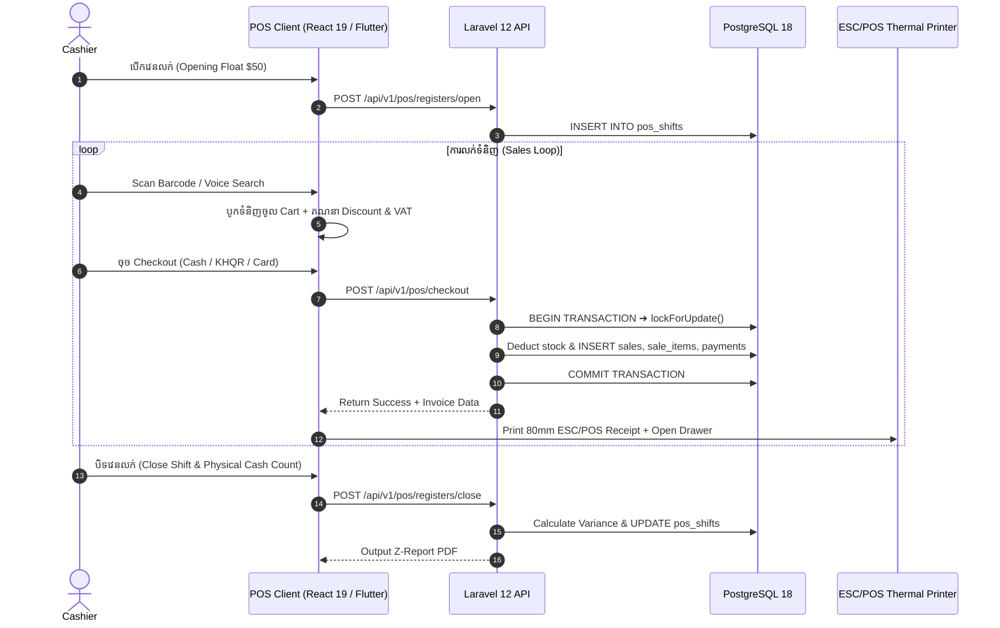

# 🛒 OptaPOS High-Speed Retail POS Subsystem

សូមស្វាគមន៍មកកាន់ **មគ្គុទ្ទេសក៍ស្ថាបត្យកម្ម និងដំណើរការលម្អិតនៃម៉ាស៊ីនគិតប្រាក់ (Point of Sale - POS)** របស់ OptaPOS។

---

## 📌 មាតិកាឯកសារលម្អិតតាមផ្នែក (Detailed POS Documentation Index)

| ឯកសារ (Document) | ខ្លឹមសារ និងដំណើរការ (Topic & Workflow) |
|---|---|
| 1. [ទិដ្ឋភាពទូទៅនៃ POS](file:///Users/macbook/Workspace/projects/showcase/Project-Enterprise-E-Commerce-POS-System/docs/pos/pos-overview.md) | ស្ថាបត្យកម្មទូទៅ, Layout ផ្ទាំង Touch Screen, និងគ្រាប់ចុចកាត់ (Hotkeys F1-F10) |
| 2. [ការគ្រប់គ្រងវេនលក់ (Shift)](file:///Users/macbook/Workspace/projects/showcase/Project-Enterprise-E-Commerce-POS-System/docs/pos/open-close-shift.md) | ការបើកវេន (Opening Float), ចរន្តលុយ Cash In/Out, និងការផ្ទៀងផ្ទាត់បិទវេន (Z-Report) |
| 3. [ការស្វែងរកទំនិញ & Barcode/Voice](file:///Users/macbook/Workspace/projects/showcase/Project-Enterprise-E-Commerce-POS-System/docs/pos/product-search-and-barcode.md) | Laser Scanner, Camera Scanner Modal, AI Voice Search, និង Variant Picker |
| 4. [ការផ្អាកកន្ត្រក (Held Carts)](file:///Users/macbook/Workspace/projects/showcase/Project-Enterprise-E-Commerce-POS-System/docs/pos/held-carts-and-multi-orders.md) | ផ្អាកកន្ត្រកភ្ញៀវភ្លេចលុយ (Parked Carts) និងការ Restore មកលក់បន្តវិញ |
| 5. [អតិថិជន & កម្រិតតម្លៃ (Loyalty)](file:///Users/macbook/Workspace/projects/showcase/Project-Enterprise-E-Commerce-POS-System/docs/pos/customer-loyalty-and-pricing.md) | ស្វែងរកអតិថិជន, កម្រិតតម្លៃ VIP/Wholesale, ការសន្សំ/ដូរពិន្ទុ, និងការទិញជំពាក់ |
| 6. [ការបញ្ចុះតម្លៃ ពន្ធ & Coupons](file:///Users/macbook/Workspace/projects/showcase/Project-Enterprise-E-Commerce-POS-System/docs/pos/discounts-taxes-and-coupons.md) | បញ្ចុះតម្លៃលើ Item/Cart, Promo Coupons, និងរូបមន្តគណនាពន្ធ Cambodian VAT 10% |
| 7. [ការទូទាត់ Bakong KHQR](file:///Users/macbook/Workspace/projects/showcase/Project-Enterprise-E-Commerce-POS-System/docs/pos/bakong-khqr-payments.md) | EMVCo Dynamic QR Code, Webhook & WebSocket ផ្ទៀងផ្ទាត់ស្វ័យប្រវត្តិនឹង NBC |
| 8. [ការទូទាត់ចម្រុះ (Split Payments)](file:///Users/macbook/Workspace/projects/showcase/Project-Enterprise-E-Commerce-POS-System/docs/pos/card-transfer-and-split-payments.md) | ការបង់ Cash + KHQR + Card ក្នុងវិក្កយបត្រតែមួយ និងការគណនាលុយអាប់ USD/KHR |
| 9. [Atomic Row Locking ស្តុក](file:///Users/macbook/Workspace/projects/showcase/Project-Enterprise-E-Commerce-POS-System/docs/pos/atomic-row-locking.md) | ការការពារកុំឱ្យលក់លើសស្តុកតាមរយៈ PostgreSQL `lockForUpdate()` ក្នុង `DB::transaction()` |
| 10. [ការបោះពុម្ពវិក្កយបត្រ (Receipt)](file:///Users/macbook/Workspace/projects/showcase/Project-Enterprise-E-Commerce-POS-System/docs/pos/receipt-printing.md) | ម៉ាស៊ីនព្រីនកម្ដៅ ESC/POS 80mm/58mm, វិក្កយបត្រផ្លូវការ A4/A5, និង Cash Drawer Kick |
| 11. [ការបង្វិលសងប្រាក់ (Refunds)](file:///Users/macbook/Workspace/projects/showcase/Project-Enterprise-E-Commerce-POS-System/docs/pos/returns-and-refunds.md) | ការទទួលទំនិញដូរ ឬសងប្រាក់, ការបូកស្តុកត្រឡប់, និងការអនុញ្ញាត Manager Override |

---

## ⚡ ដំណើរការសង្ខេបពីដើមដល់ចប់ (Complete Lifecycle Diagram)

---
*ឯកសារពាក់ព័ន្ធ:*
- [Master Documentation Hub](file:///Users/macbook/Workspace/projects/showcase/Project-Enterprise-E-Commerce-POS-System/docs/README.md)
- [Sales Business Domain](file:///Users/macbook/Workspace/projects/showcase/Project-Enterprise-E-Commerce-POS-System/docs/business-domains/sales/README.md)
