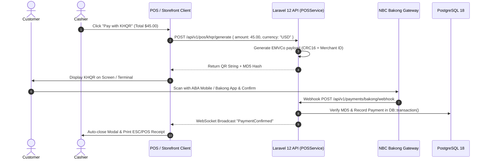

# 💳 Bakong KHQR Payment Integration Manual

## 1. Overview
The **OptaPOS Bakong KHQR Subsystem** enables real-time cashless mobile banking payments compliant with the **National Bank of Cambodia (NBC) EMVCo QR standard** across the web POS, customer storefront, and mobile app.

---

## 2. Why It Exists
Cashless payments through ABA PAY, ACLEDA, Wing, and Sathapana account for over 80% of retail transactions in Cambodia. Integrating standard Bakong KHQR removes manual bank transfer slip verification and guarantees instant, automated payment confirmation.

---

## 3. KHQR Payment Lifecycle (End-to-End Flow)

---

## 4. Technical Specifications

### Key Files Involved
- **Backend Service**: `backend/app/Services/POS/BakongKHQRService.php`
- **Controller**: `backend/app/Http/Controllers/Api/V1/Payment/BakongController.php`
- **Database Tables**: `payments`, `payment_methods`, `sales`
- **Frontend Component**: `admin-dashboard/src/pages/pos/components/KHQRModal.tsx`
- **Mobile Component**: `mobile_app/lib/features/pos/presentation/widgets/khqr_dialog.dart`

---

## 5. Currency Handling & National Bank of Cambodia (NBC) Rates
- **USD Transactions**: Precision to 2 decimal places (`45.50 USD`).
- **KHR Transactions**: Rounded to nearest 100 Riel (e.g. `185,000 KHR`).
- **Exchange Rate**: Maintained dynamically in `currency_rates` table, fetched from NBC or set in Admin Settings.

---
*Related Docs:*
- [POS Overview](file:///Users/macbook/Workspace/projects/showcase/Project-Enterprise-E-Commerce-POS-System/docs/pos/README.md)
- [Atomic Row Locking](file:///Users/macbook/Workspace/projects/showcase/Project-Enterprise-E-Commerce-POS-System/docs/pos/atomic-row-locking.md)
