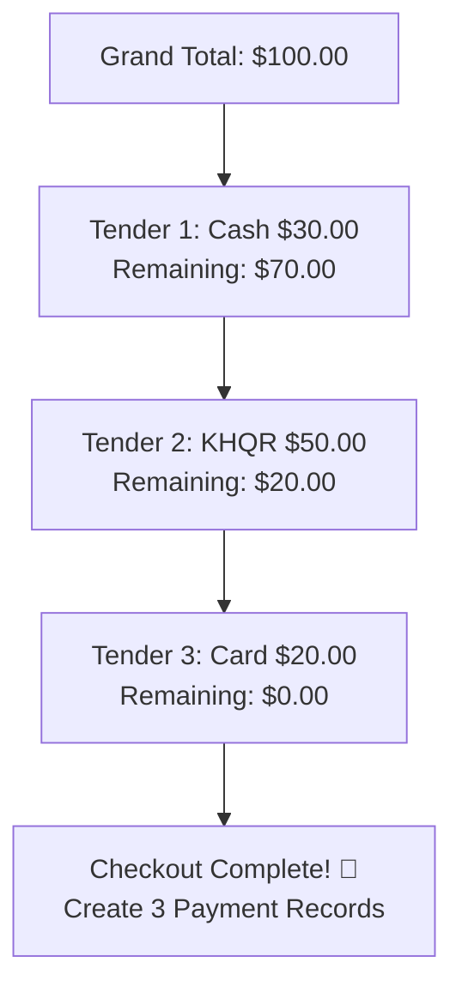

# 💳 វិធីសាស្ត្រទូទាត់ចម្រុះ និងការបំបែកការទូទាត់ (Split Tender & Multi-Currency)

## 1. សេចក្តីផ្តើម (Overview)
នៅក្នុងបរិបទប្រទេសកម្ពុជា ការទូទាត់តែងតែមានការលាយបញ្ចូលគ្នារវាង **ប្រាក់ដុល្លារ (USD)**, **ប្រាក់រៀល (KHR)**, **Bakong KHQR**, និង **កាតធនាគារ (Card)**។ OptaPOS គាំទ្រការទូទាត់បែប **Split Tender (បំបែកការទូទាត់ច្រើនមធ្យោបាយក្នុងវិក្កយបត្រតែមួយ)** យ៉ាងរលូន។

---

## 2. វិធីសាស្ត្រទូទាត់ដែលគាំទ្រ (Supported Payment Methods)

| វិធីសាស្ត្រទូទាត់ | Modal Component | ការពិពណ៌នា និងដំណើរការ |
|---|---|---|
| 💵 **Cash (USD & KHR)** | `Quick Cash Buttons` | បញ្ចូលចំនួនលុយទទួលជា USD ឬ KHR ប្រព័ន្ធនឹងគណនាលុយអាប់ស្វ័យប្រវត្តិ |
| 📱 **Bakong KHQR** | `POSKHQRModal.tsx` | បង្កើត dynamic EMVCo QR code ផ្ទៀងផ្ទាត់ស្វ័យប្រវត្តិតាម Webhook/WebSocket |
| 💳 **Credit / Debit Card** | `POSCardPaymentModal.tsx` | Visa, Mastercard, UnionPay (បញ្ចូលលេខកូដ Approval Code ពីម៉ាស៊ីន POS Card) |
| 🏦 **Bank Transfer** | `POSTransferPaymentModal.tsx` | ផ្ទេរផ្ទាល់តាម ABA, ACLEDA, Wing, Sathapana (បញ្ចូល Bank Ref Number) |
| 👥 **Customer Credit** | `POSCustomerModal.tsx` | កត់ត្រាជាបំណុលអតិថិជន (Accounts Receivable / On Due) |

---

## 3. ដំណើរការបំបែកការទូទាត់ (Split Payment Flow)

ឧទាហរណ៍៖ វិក្កយបត្រសរុបមានតម្លៃ **$100.00**  
អតិថិជនចង់បង់៖
1. **Cash**: `$30.00`
2. **Bakong KHQR**: `$50.00` (បាញ់តាម ABA)
3. **Card**: `$20.00` (កាត Visa)

Backend នឹងកត់ត្រា record ចំនួន ៣ ចូលក្នុងតារាង `payments` ដោយភ្ជាប់ជាមួយ `sale_id` តែមួយ៖
- Row 1: `payment_method = 'cash'`, `amount = 30.00`
- Row 2: `payment_method = 'khqr'`, `amount = 50.00`
- Row 3: `payment_method = 'card'`, `amount = 20.00`

---

## 4. ការគណនាលុយអាប់ពហុរូបិយប័ណ្ណ (Dual-Currency Change Calculation)

អតិថិជនអាចឱ្យប្រាក់ដុល្លារ និងសុំលុយអាប់ជារៀល ឬច្រាសមកវិញ៖
- **អត្រាប្តូរប្រាក់ (Exchange Rate)**៖ ឧទាហរណ៍ `$1.00 = 4,100 ៛`
- ប្រសិនបើវិក្កយបត្រតម្លៃ `$18.50` ហើយភ្ញៀវឱ្យក្រដាស `$20.00`៖
  - **លុយអាប់ជាដុល្លារ**: `Change USD = $1.50`
  - **លុយអាប់ជារៀល**: `Change KHR = $1.50 × 4,100 = 6,150 ៛` (បង្គត់ត្រឹម `6,200 ៛`)

---
*ឯកសារពាក់ព័ន្ធ:*
- [ការទូទាត់ Bakong KHQR](file:///Users/macbook/Workspace/projects/showcase/Project-Enterprise-E-Commerce-POS-System/docs/pos/bakong-khqr-payments.md)
- [ការបោះពុម្ពវិក្កយបត្រ (Receipt Printing)](file:///Users/macbook/Workspace/projects/showcase/Project-Enterprise-E-Commerce-POS-System/docs/pos/receipt-printing.md)
