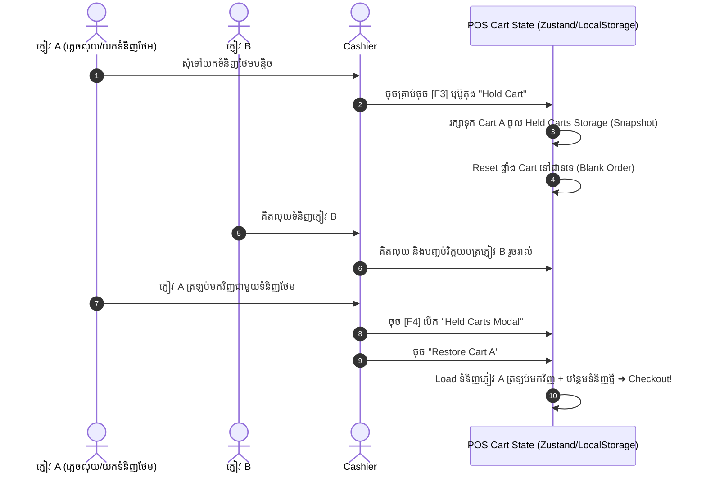

# 📦 ការផ្អាកកន្ត្រកទំនិញបណ្តោះអាសន្ន (Held Carts & Multi-Customer Handling)

## 1. សេចក្តីផ្តើម (Overview)
មុខងារ **Held Carts (Parking Orders)** ត្រូវបានបង្កើតឡើងដើម្បីការពារការកកស្ទះជួរទូទាត់នៅពេលអតិថិជនម្នាក់ភ្លេចយកកាបូបលុយ ឬដើរទៅយកទំនិញបន្ថែម។ Cashier អាចផ្អាកកន្ត្រកនោះទុក ហើយបម្រើអតិថិជនបន្ទាប់ភ្លាមៗដោយមិនបាច់លុបទំនិញចោលឡើយ។

---

## 2. ដំណើរការលម្អិត (How Held Carts Work)



---

## 3. រចនាសម្ព័ន្ធទិន្នន័យនៃ Held Cart Snapshot

Held Cart Snapshot ត្រូវបានរក្សាទុកក្នុង Local Storage / Zustand ដោយមានរចនាសម្ព័ន្ធ៖

```typescript
interface HeldCart {
  id: string              // UUID ឧទាហរណ៍: "cart-1740412345"
  referenceNote: string   // សម្គាល់: "ភ្ញៀវពាក់អាវស" ឬ "តុលេខ ៤"
  createdAt: string       // កាលបរិច្ឆេទ & ម៉ោងដែលបានផ្អាក
  customer?: Customer     // ព័ត៌មានអតិថិជន (បើសិនជាបានជ្រើសរើស)
  items: CartItem[]       // បញ្ជីទំនិញ, ចំនួន, Variant, តម្លៃ
  discountType: 'fixed' | 'percent'
  discountValue: number
  couponCode?: string
  totalAmount: number
}
```

---

## 4. វិធានអាជីវកម្ម & សុវត្ថិភាពស្តុក (Business Rules)

1. **មិនកាត់ស្តុកមុនពេល Checkout (No Stock Deduction on Hold)**៖
   - ការផ្អាកកន្ត្រក (Hold Cart) **មិនទាន់កាត់ស្តុកចេញពីឃ្លាំងទេ** ដើម្បីកុំឱ្យខកខានឱកាសលក់ទៅឱ្យភ្ញៀវផ្សេង។
2. **ការត្រួតពិនិត្យស្តុកឡើងវិញពេល Restore (Re-validation on Resume)**៖
   - ពេលដែល Cashier ទាញ Cart ដែលផ្អាកត្រឡប់មកវិញ ប្រព័ន្ធនឹងផ្ទៀងផ្ទាត់ស្តុកជាក់ស្តែងឡើងវិញភ្លាមៗ (Real-time Stock Re-check)។ ប្រសិនបើទំនិញណាមួយត្រូវបានលក់ដាច់អស់ដោយ Cashier ផ្សេង ប្រព័ន្ធនឹងបង្ហាញ Alert ជូនដំណឹង។
3. **ចំនួន Held Carts អតិបរមា**៖
   - ប្រព័ន្ធអនុញ្ញាតឱ្យ Hold បានរហូតដល់ **20 Carts ក្នុងពេលតែមួយ** ក្នុង Register នីមួយៗ។

---
*ឯកសារពាក់ព័ន្ធ:*
- [POS Overview](file:///Users/macbook/Workspace/projects/showcase/Project-Enterprise-E-Commerce-POS-System/docs/pos/pos-overview.md)
- [ការទូទាត់ Bakong KHQR](file:///Users/macbook/Workspace/projects/showcase/Project-Enterprise-E-Commerce-POS-System/docs/pos/bakong-khqr-payments.md)
