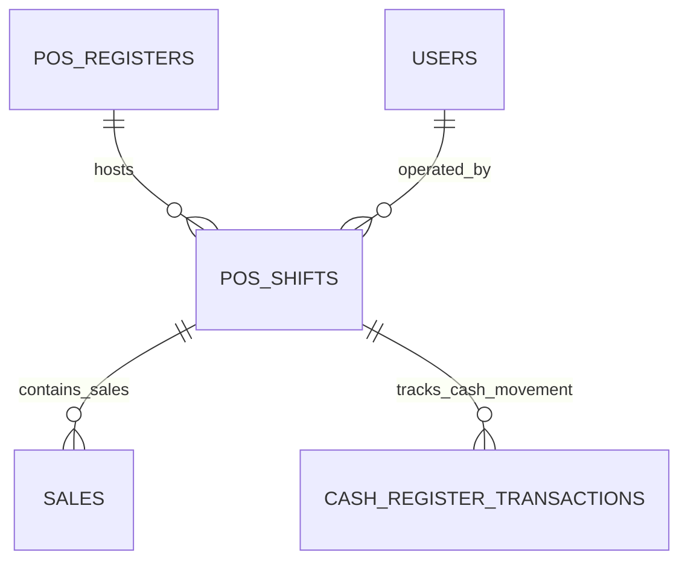

# ⏱️ ការគ្រប់គ្រងវេនលក់ និងថតដាក់ប្រាក់ (Open/Close Shift & Cash Register)

## 1. សេចក្តីផ្តើម (Overview)
ការគ្រប់គ្រងវេនលក់ (Shift Management) គឺជាប្រព័ន្ធតាមដានលំហូរសាច់ប្រាក់របស់ Cashier ម្នាក់ៗចាប់តាំងពីពេលបើកហាងរហូតដល់បិទវេន។ វាធានាថារាល់ប្រាក់ចំណូលតាម **Cash**, **KHQR**, **Card**, និង **Bank Transfer** ត្រូវបានផ្ទៀងផ្ទាត់យ៉ាងម៉ត់ចត់ជាមួយប្រព័ន្ធគណនេយ្យ។

---

## 2. ដំណើរការលម្អិតតាមជំហាន (Step-by-Step Workflow)

### ជំហានទី ១៖ ការបើកវេនលក់ (Open Shift)
1. Cashier ចូលទៅកាន់ POS Screen។ ប្រសិនបើមិនទាន់មាន Shift សកម្ម ប្រព័ន្ធនឹងបង្ហាញផ្ទាំង **"Open Cash Register"**។
2. Cashier រាប់ចំនួនលុយដើមគ្រា (Opening Float/Cash) ដែលមានក្នុងថត (ឧទាហរណ៍៖ `$50.00` និង `200,000 ៛`)។
3. Frontend ផ្ញើ Request `POST /api/v1/pos/registers/open`៖
   ```json
   {
     "register_id": 1,
     "opening_balance_usd": 50.00,
     "opening_balance_khr": 200000,
     "note": "Morning Shift Opening Float"
   }
   ```
4. Backend បង្កើត record ថ្មីក្នុងតារាង `pos_shifts` ដោយកំណត់ status ជា `open`។

---

### ជំហានទី ២៖ ប្រតិបត្តិការចរន្តលុយក្នុងវេន (Cash In / Cash Out During Shift)
ក្នុងអំឡុងពេលលក់ ប្រសិនបើមានតម្រូវការដកលុយទិញសម្ភារៈបន្ទាន់ ឬថែមលុយអាប់៖
- **Cash In (បញ្ចូលលុយ)**៖ បន្ថែមលុយអាប់ពីមេការ (Manager Float Replenishment)។
- **Cash Out (ដកលុយ)**៖ ដកលុយបង់ថ្លៃដឹកជញ្ជូន ឬចំណាយបន្ទាន់ (Petty Cash)។
- Endpoint: `POST /api/v1/pos/registers/transaction` (កត់ត្រាចូល `cash_register_transactions`)។

---

### ជំហានទី ៣៖ ការបិទវេនលក់ & ផ្ទៀងផ្ទាត់សាច់ប្រាក់ (Close Shift Reconciliation)
1. នៅចុងវេន Cashier ចុចប៊ូតុង **"Close Shift"**។
2. Cashier ធ្វើការរាប់សាច់ប្រាក់ជាក់ស្តែងក្នុងថត (Physical Cash Count) ហើយបញ្ចូលតួលេខ។
3. Backend គណនា **Expected Cash (ប្រាក់ដែលប្រព័ន្ធរំពឹងទុក)**៖
   $$\text{Expected Cash} = \text{Opening Float} + \text{Total Cash Sales} + \text{Cash In} - \text{Cash Out} - \text{Cash Refunds}$$
4. គណនា **Variance (គម្លាតខ្វះ/លើស)**៖
   $$\text{Difference} = \text{Closing Actual Cash} - \text{Expected Cash}$$
   - បើ `Difference > 0` ➜ **Overage (លុយលើស)**
   - បើ `Difference < 0` ➜ **Shortage (លុយខ្វះ)**
5. Backend បិទ Shift (`status = 'closed'`) និងចេញ **Z-Report (របាយការណ៍បិទបញ្ជី)**។

---

## 3. រចនាសម្ព័ន្ធ Database (Database Architecture)



### តារាងសំខាន់ៗ៖
- **`pos_registers`**: កត់ត្រាឈ្មោះកន្លែងគិតប្រាក់ (Counter 1, Counter 2, Bar Register)។
- **`pos_shifts`**: រក្សាទុក `user_id`, `opening_balance`, `closing_balance`, `expected_balance`, `difference`, `opened_at`, `closed_at`។
- **`cash_register_transactions`**: រក្សាទុកប្រវត្តិ `cash_in` / `cash_out` ជាមួយ Reason និង User ID។

---

## 4. API Endpoints ពាក់ព័ន្ធ

| Method | Endpoint | ការពិពណ៌នា | Permission |
|---|---|---|---|
| `GET` | `/api/v1/pos/registers/status` | ពិនិត្យមើលថាតើ Cashier មាន Shift កំពុងបើកឬអត់ | `pos.terminal.access` |
| `POST` | `/api/v1/pos/registers/open` | បើកវេនលក់ថ្មីជាមួយ Opening Balance | `pos.shift.open` |
| `POST` | `/api/v1/pos/registers/transaction` | កត់ត្រា Cash In ឬ Cash Out | `pos.cash.transfer` |
| `POST` | `/api/v1/pos/registers/close` | បិទវេនលក់ គណនា Variance និងចេញ Z-Report | `pos.shift.close` |
| `GET` | `/api/v1/pos/registers/shifts/{id}/report` | ទាញយករបាយការណ៍សង្ខេបវេនលក់ (Z-Report PDF) | `reports.pos.view` |

---
*ឯកសារពាក់ព័ន្ធ:*
- [POS Overview](file:///Users/macbook/Workspace/projects/showcase/Project-Enterprise-E-Commerce-POS-System/docs/pos/pos-overview.md)
- [ការទូទាត់ចម្រុះ (Split Payments)](file:///Users/macbook/Workspace/projects/showcase/Project-Enterprise-E-Commerce-POS-System/docs/pos/card-transfer-and-split-payments.md)
