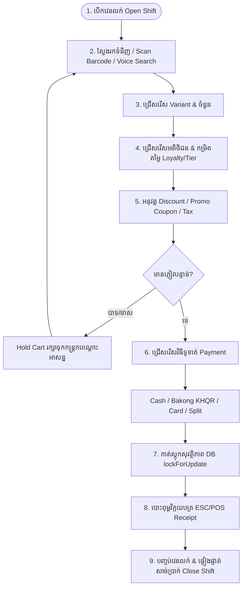

# 🛒 OptaPOS Subsystem: សេចក្តីសង្ខេបស្ថាបត្យកម្ម & ដំណើរការទូទៅ (POS Overview)

## 1. សេចក្តីផ្តើម (Overview)
**OptaPOS POS Subsystem** គឺជាម៉ាស៊ីនគិតប្រាក់កម្រិត Enterprise ដែលត្រូវបង្កើតឡើងសម្រាប់ប្រតិបត្តិការលក់រហ័ស (High-Speed Retail Checkout) ទាំងលើ **Web Browser (React 19 Admin)** និង **Mobile Terminal (Flutter 3.24)**។ វាភ្ជាប់ផ្ទាល់ទៅកាន់ **Laravel 12 Backend API** និង **PostgreSQL 18** ដោយធានានូវល្បឿនលក់លឿន សុវត្ថិភាពស្តុក និងការទូទាត់ចម្រុះ (Multi-Tender Payments)។

---

## 2. ហេតុអ្វីបានជាត្រូវមាន POS នេះ? (Why It Exists)
នៅក្នុងអាជីវកម្មលក់រាយធំៗ បញ្ហាទូទៅរួមមាន៖
1. **កកស្ទះជួរទូទាត់ (Checkout Bottlenecks)**៖ បុគ្គលិកគិតប្រាក់យឺត ដោយសារប្រព័ន្ធពិបាកស្វែងរកទំនិញ។
2. **លក់លើសស្តុកជាក់ស្តែង (Stock Overselling)**៖ ពេលមាន Cashier ច្រើននាក់ ឬលក់លើ Web ដំណាលគ្នា ធ្វើឱ្យស្តុកខុសគ្នា។
3. **ការបាត់បង់សាច់ប្រាក់ (Cash Discrepancies)**៖ គ្មានការកត់ត្រា Shift បើក/បិទវេន និងចរន្តលុយ Cash In/Out ច្បាស់លាស់។
4. **ការទូទាត់ Cashless មានភាពរញ៉េរញ៉ៃ**៖ បុគ្គលិកត្រូវចាំពិនិត្យ Slip ធនាគារដោយដៃ។

OptaPOS ដោះស្រាយបញ្ហាទាំងនេះ ១០០% តាមរយៈ **Atomic Row Locking**, **Automated Bakong KHQR Verification**, **Held Carts System**, និង **Cash Drawer Shift Reconciliation**។

---

## 3. ដ្យាក្រាមលំហូរការងារទូទៅ (End-to-End POS Lifecycle)

---

## 4. សមាសភាគសំខាន់ៗលើផ្ទាំង UI (UI Components Breakdown)

| ឈ្មោះ Component | ទីតាំង File | តួនាទី និងមុខងារ |
|---|---|---|
| **`POSPage.tsx`** | `admin-dashboard/src/pages/pos/POSPage.tsx` | Main Container គ្រប់គ្រង Cart State, Active Register, Hotkeys, និង Totals |
| **`POSHeader.tsx`** | `.../pos/components/POSHeader.tsx` | បង្ហាញព័ត៌មាន Cashier, ឈ្មោះសាខា, ប៊ូតុង Hold Carts, និងម៉ោងបច្ចុប្បន្ន |
| **`POSProductCard.tsx`** | `.../pos/components/POSProductCard.tsx` | Card បង្ហាញរូបទំនិញ, តម្លៃ, ស្តុកជាក់ស្តែង, និង Badge ពណ៍សម្គាល់ |
| **`POSCameraScannerModal.tsx`** | `.../pos/components/POSCameraScannerModal.tsx` | ម៉ាស៊ីន Scan Barcode/QR តាមរយៈ Device Camera ផ្ទាល់ |
| **`POSVoiceSearchPopover.tsx`** | `.../pos/components/POSVoiceSearchPopover.tsx` | ស្វែងរកទំនិញដោយប្រើសម្លេង (Web Speech Recognition API) |
| **`POSKHQRModal.tsx`** | `.../pos/components/POSKHQRModal.tsx` | បង្ហាញ dynamic Bakong KHQR និងស្តាប់ WebSocket ពេលភ្ញៀវបាញ់លុយរួច |
| **`POSReceiptModal.tsx`** | `.../pos/components/POSReceiptModal.tsx` | ផ្ទាំង Preview & Print វិក្កយបត្រកម្ដៅ (Thermal 80mm/58mm) |
| **`POSHeldCartsModal.tsx`** | `.../pos/components/POSHeldCartsModal.tsx` | បញ្ជី Cart ដែលបានផ្អាកទុក (Parked Orders) |

---

## 5. គ្រាប់ចុចកាត់សម្រាប់ការលក់រហ័ស (Keyboard Shortcuts / Hotkeys)

ដើម្បីឱ្យ Cashier មិនបាច់កាន់ Mouse នាំតែយឺត យើងបានបំពាក់ Global Hotkeys៖
- `F1` ឬ `Space`: Focus ទៅកាន់ប្រអប់ Search / Barcode Input ភ្លាមៗ
- `F2`: បើកផ្ទាំងជ្រើសរើសអតិថិជន (Customer Lookup)
- `F3`: ផ្អាកកន្ត្រកបច្ចុប្បន្ន (Hold Current Cart)
- `F4`: បើកមើលបញ្ជីកន្ត្រកដែលបានផ្អាក (View Held Carts)
- `F8`: អនុវត្តការបញ្ចុះតម្លៃទូទៅ (Discount)
- `F9`: ទូទាត់សាច់ប្រាក់រហ័ស (Quick Cash Checkout)
- `F10`: ទូទាត់តាម Bakong KHQR (Open KHQR Modal)
- `Esc`: បិទ Modal ឬ Cancel Action

---
*ឯកសារពាក់ព័ន្ធ:*
- [ការគ្រប់គ្រងវេនលក់ (Open/Close Shift)](file:///Users/macbook/Workspace/projects/showcase/Project-Enterprise-E-Commerce-POS-System/docs/pos/open-close-shift.md)
- [ការស្វែងរកទំនិញ & Barcode/Voice](file:///Users/macbook/Workspace/projects/showcase/Project-Enterprise-E-Commerce-POS-System/docs/pos/product-search-and-barcode.md)
- [ការទូទាត់ Bakong KHQR](file:///Users/macbook/Workspace/projects/showcase/Project-Enterprise-E-Commerce-POS-System/docs/pos/bakong-khqr-payments.md)
