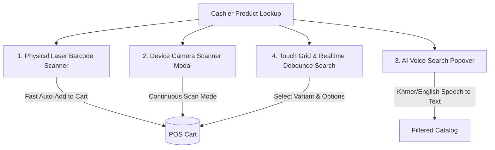

# 🔍 ការស្វែងរកទំនិញ Barcode, Camera & Voice Search លើ POS

## 1. សេចក្តីផ្តើម (Overview)
ដើម្បីបង្កើនល្បឿននៃការគិតប្រាក់ឱ្យបានលឿនបំផុត OptaPOS បានបំពាក់ប្រព័ន្ធស្វែងរកទំនិញពហុទម្រង់ (Multi-Modal Product Lookup) ចំនួន ៤ របៀប ដែល Cashier អាចប្រើប្រាស់បានតាមភាពជាក់ស្តែង។

---

## 2. វិធីសាស្ត្រស្វែងរកទាំង ៤ របៀប (4 Lookup Modalities)

---

### របៀបទី ១៖ ម៉ាស៊ីនបាញ់ Barcode លើតុ (Physical Laser / USB / Bluetooth Scanner)
- **ដំណើរការ**: កាំភ្លើងបាញ់ Barcode ដំណើរការដូចជាក្តារចុចល្បឿនលឿន (Keyboard Wedge Emulation) ដោយវាយបញ្ចូលលេខកូដ និងបញ្ចប់ដោយគ្រាប់ចុច `Enter` ក្នុងរយៈពេលខ្លី (< 50ms)។
- **ការអនុវត្តលើ Code (`useBarcodeListener.ts`)**:
  - Event listener ចាប់យក key strokes ជាស៊េរី។ ប្រសិនបើចន្លោះពេលរវាង key តូចជាង 30ms និងបញ្ចប់ដោយ `Enter` ប្រព័ន្ធនឹងចាត់ទុកជា Barcode Scan ដោយស្វ័យប្រវត្តិ។
  - ស្វែងរកតាម SKU/Barcode ភ្លាមៗ៖ បើទំនិញគ្មាន Variant វានឹង **បូកចូល Cart ភ្លាមៗ (Auto-Add)** ដោយមិនបាច់ចុច Mouse ឡើយ។
  - បើទំនិញមាន Variant ច្រើន វានឹងបើក `POSProductDetailModal` ដើម្បីឱ្យរើស Option។

---

### របៀបទី ២៖ ស្កេនតាមរយៈ Camera កុំព្យូទ័រ/ទូរស័ព្ទ (`POSCameraScannerModal.tsx`)
- **សមាសភាគ**: បំពាក់បច្ចេកវិទ្យា **WebRTC Video Stream** + **BarcodeDetector API** (និង ZXing JS Library ជា Fallback)។
- **មុខងារពិសេស**:
  - គាំទ្រ Barcode ស្តង់ដាទាំងអស់៖ `EAN-13`, `EAN-8`, `UPC-A`, `Code-128`, `QR Code`, `DataMatrix`។
  - **Beep Sound**: បញ្ចេញសំឡេង "ប៊ីប" ពេលស្កេនបានជោគជ័យ។
  - **Torch/Flashlight Toggle**: បើកភ្លើង Flash ពេលស្កេនក្នុងទីងងឹត។
  - **Continuous Scanning Mode**: ស្កេនទំនិញបន្តបន្ទាប់គ្នាដោយមិនចាំបាច់បិទបើកផ្ទាំង Camera ឡើងវិញ។

---

### របៀបទី ៣៖ ស្វែងរកតាមសម្លេង AI (`POSVoiceSearchPopover.tsx`)
- **សមាសភាគ**: ប្រើប្រាស់ **Web Speech Recognition API** គាំទ្រភាសាខ្មែរ (`km-KH`) និងអង់គ្លេស (`en-US`)។
- **ដំណើរការ**:
  1. Cashier ចុចរូប Microphone ឬចុចគ្រាប់ចុចកាត់។
  2. និយាយឈ្មោះទំនិញ ឧទាហរណ៍៖ *"MacBook Pro"* ឬ *"ខ្សែសាក Type C"*។
  3. សម្លេងត្រូវបានបំប្លែងទៅជាអត្ថបទ (Speech-to-Text) ក្នុងពេលពិត (Real-Time Transcript) និងដាក់បញ្ចូលក្នុង Search Query ភ្លាមៗ។

---

### របៀបទី ៤៖ Touch Grid & Debounced Keyword Filter
- **Debounce 300ms**: កាត់បន្ថយបន្ទុក Server ពេល Cashier វាយអក្សរស្វែងរក។
- **Category & Brand Chips**: ចុចជ្រើសរើសប្រភេទ (Laptops, Phones, Accessories) ដើម្បីច្រោះទំនិញបានលឿន។
- **Stock Status Badge**: បង្ហាញពណ៍បៃតង (In Stock), ទឹកក្រូច (Low Stock < 5), ឬក្រហម (Out of Stock) លើរូបទំនិញផ្ទាល់។

---

## 3. ផ្ទាំងជ្រើសរើស Variant (`POSProductDetailModal.tsx`)

ប្រសិនបើទំនិញមានជម្រើសច្រើន (ឧទាហរណ៍៖ iPhone 16 Pro Max មានពណ៌ និងទំហំផ្ទុកខុសៗគ្នា)៖
- បង្ហាញ Matrix នៃ Attributes (Color, Storage, RAM)។
- បង្ហាញតម្លៃជាក់លាក់ និងចំនួនស្តុកដែលនៅសល់ក្នុងឃ្លាំងបច្ចុប្បន្នសម្រាប់ Variant នីមួយៗ។
- អនុញ្ញាតឱ្យបញ្ចូល Note ពិសេសសម្រាប់ទំនិញនោះ (Item-level remark)។

---
*ឯកសារពាក់ព័ន្ធ:*
- [POS Overview](file:///Users/macbook/Workspace/projects/showcase/Project-Enterprise-E-Commerce-POS-System/docs/pos/pos-overview.md)
- [ការគ្រប់គ្រង Held Carts](file:///Users/macbook/Workspace/projects/showcase/Project-Enterprise-E-Commerce-POS-System/docs/pos/held-carts-and-multi-orders.md)
