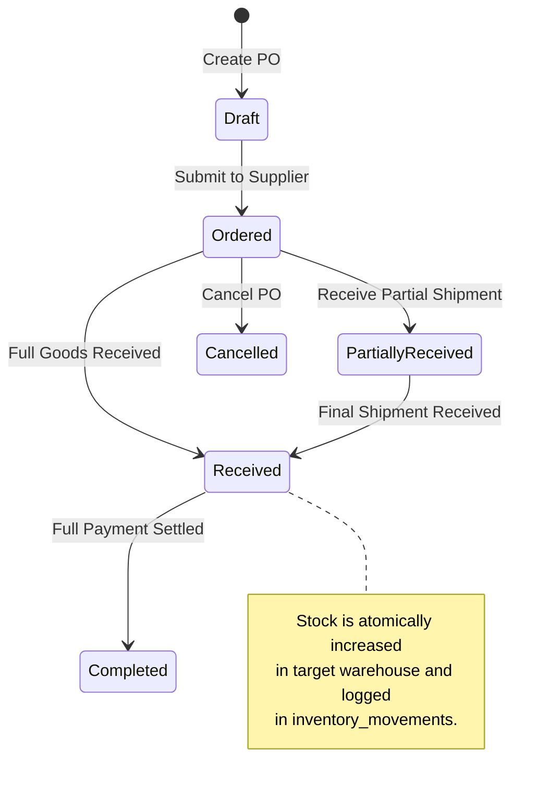

# 🛒 Purchase & Procurement Flow

## 1. Purchase Lifecycle & Inventory Integration

The procurement module manages supplier catalogs, purchase orders (POs), goods receiving notes (GRN), landed costs, and supplier payments.

---

## 2. Goods Receiving & Stock Incrementation

When physical shipments arrive at the warehouse:
1. Warehouse receiver opens `POST /api/v1/purchases/{id}/receive`.
2. Specifies the received quantity for each line item (`quantity_received`).
3. The backend executes a database transaction (`PurchaseService.php`):
   - Updates `purchase_items.quantity_received`.
   - Locates or creates the `inventories` record for `(warehouse_id, product_id)`.
   - Increments `inventories.quantity`.
   - Creates an `inventory_movements` record with `type = 'purchase'` and `reference_id = purchase.id`.
   - Updates `purchases.status` to `received` or `partial`.
4. If purchase price differs from previous cost, the product's `cost_price` can be updated using Weighted Average Costing (WAC).
