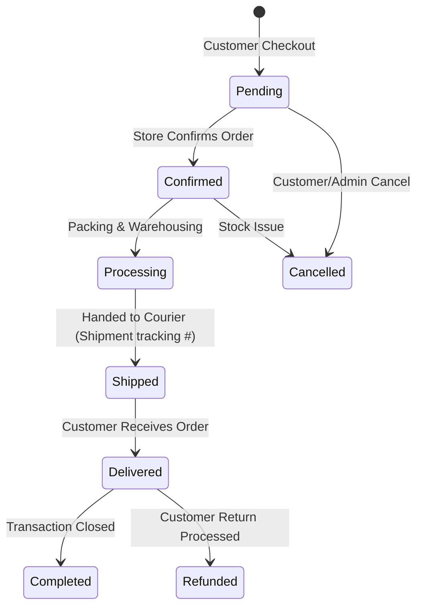

# 🛍️ Omnichannel Sales & Order Fulfillment Flow

## 1. Sales & Order Channels

The system unifies two main sales streams into a single reporting engine:
1. **POS Physical Sales (`sales` & `sale_items`)**: Instant in-store purchases processed through cash registers.
2. **Online E-Commerce Orders (`orders` & `order_items`)**: Customer-placed orders via the customer web storefront (`customer-website/`) or mobile shopping app (`mobile_app/`).

---

## 2. Order Fulfillment & Delivery Tracking

1. **Order Creation**: Customer adds items to cart and completes checkout (`POST /api/v1/orders`). Order enters `pending` state and reserves stock (`inventories.reserved_quantity`).
2. **Confirmation**: Store manager reviews and confirms the order (`POST /api/v1/orders/{id}/confirm`).
3. **Dispatch & Tracking**: Order is packed and assigned a shipping carrier and tracking code (`POST /api/v1/orders/{id}/ship`).
4. **Delivery & Completion**: Courier confirms delivery (`POST /api/v1/orders/{id}/deliver`). Reserved stock is converted to actual deduction (`type = 'out'`).
5. **Invoicing**: Printable tax invoice and PDF download available at `GET /api/v1/orders/{id}/invoice`.
